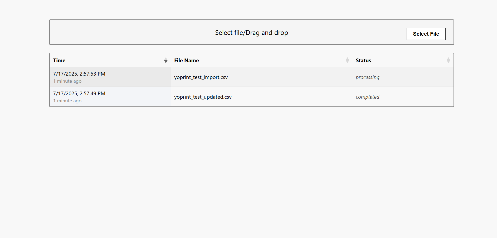

# YoPrint Interview Project

A Laravel-based file upload and real-time status dashboard using Echo, Pusher, Redis, and SQLite.



## Features
- File upload with status tracking
- Real-time status updates via Pusher and Laravel Echo
- Uses Redis for queueing and broadcasting events
- Built with SQLite for easy local setup

## Setup

1. **Clone repo**
   
2. **Install PHP dependencies**
   ```bash
   composer install
   ```
   
3. **npm install && npm run dev**
   ```bash
   npm install && npm run dev
   ```
   
4.**Copy .env and generate key**
  ```bash
  cp .env.example .env
  php artisan key:generate
  ```
  
5.**Fill in pusher credentials**

6.**Create SQLite DB file**
  ```bash
   touch database/database.sqlite
  ```

7.**Run migrations**
  ```bash
   php artisan migrate
   ```

8.**Make sure Redis is running on machine**

9.**Start the queue worker (in a new terminal)**
  ```bash
   php artisan queue:work
  ```
   
10.**artisan serve**
  ```bash
   php artisan serve
  ```

